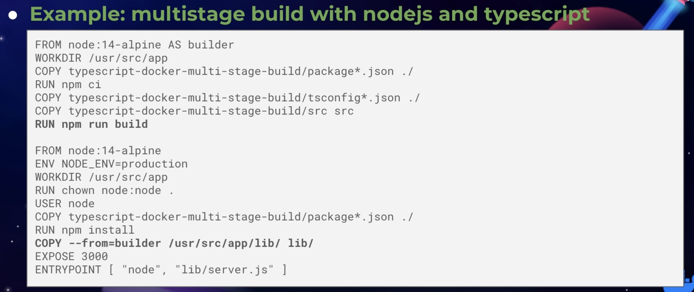

# News and insights from DockerCon. Best practices for node and docker
There was a Docker conference on the 27.05.2021. Here is the
[link](https://docker.events.cube365.net/dockercon-live/2021)

## Before we start
- The list of recommendations for best practices is NOT complete here because:
    - some things seemed too obvious
    - some things weren't well justified in the talk on the conference
    - some things were too hard to understand i.e.:
        - poorly explained or
        - heavy sysadmin stuff
- Recommendation are NOT ordered or structured in any way
- All listed recommendations are there because I thought that they are IMO
  either:
    - not obvious or
    - important enough

## Recommendations for security and performance

- Do not ignore `.dockerignore` because it can reduce image size drastically
    - see `.dockerignore` file example
- Use small base images e.g.
    - build from scratch
    - alpine images - `FROM node:14-alpine`
    - slim images - `FROM node:14-buster-slim`
    - use [Distroless](https://github.com/GoogleContainerTools/distroless)
      images (by Google; include only needed libs like `glibc`)
    - combine heavy and NOT heavy base images in multi-stage builds
    ```dockerfile
    # FIRST STAGE - BUILD
    # - debian based node image
    FROM node:latest AS build
    # ...
    
    # SECOND STAGE - OPTIMIZE, PUBLISH, SERVE
    # - alpine based node image
    FROM node:lts-alpine
    # ...
    COPY --chown=node:node --from=build /app/node_modules /app/node_modules
    # ...
    ```
- Avoid running containers as root unless necessary
    - `RUN chown` shell command and use `USER` stanza
    - `COPY --chown` flag and use `USER` stanza
    
- Use multi-stage builds
    - reduces the surface for an attack
    - reduces the size of your image - the smaller the image the less
      vulnerabilities there
    
- Better don't use `:latest` tag because
    - it changes often
    - there can be breaking changes
- Prefer `COPY` over `ADD`
    - `COPY` is more explicit and predictable
    - `ADD` can do more things like copying files from a url or tar file
- Do NOT include any secrets into Dockerfiles
    - WRONG: `ENV SECURE_TOKEN=123`
- Chain your `RUN` commands
    - each docker command creates a layer, so multiple `RUN` commands will
      create multiple layers - avoid it
    - clean up because it can drastically reduce the image size
        - any cleanup in a layer MUST BE DONE IN THAT SAME LAYER
```dockerfile
# Example of chaining shell commands (and also a cleanup)

# UPDATE, UPGRADE and CLEANUP debian packages
RUN export DEBIAN_FRONTEND=noninteractive && \
    apt-get update && \
    apt-get upgrade --yes && \
    apt-get install --yes build-essential libpq-dev && \
    apt-get clean && \
    rm -rf /var/lib/apt/lists/*
```
- do NOT put secrets to `ARG` or `ENV` because it is committed to the layer
    - see Bonus section for details

## Interesting
- To build a docker image for Arm, you need to use a base image from Arm repo
    - `FROM arm64v8/node:14`
- alpine images can be problematic because they use **musl** instead of
  **glibc** (**musl** is a modernized version of **glibc**)
    - so use slim images
- Buildkit (buildx tool) is great
    - it is major rethinking how to do image builds, e.g.:
        - you can pass built-time arguments which are NOT gonna be
          committed to a layer
        - you can pass SSH agent keys (private repo clone in the container)
        - enables concurrent builds
        - enables distributed builds via a registry build cache (can
          significantly reduce build times, but so far supported only by
          Docker Hub)
        - Multi-arch builds (One app for both Arm64 and Amd64)
        - ...
    - introduced in docker 18.09
    - still behind feature flag (slowly merging into `build` command)
    - `DOCKER_BUILDKIT=1 docker image build --tag blah .`
        - or add `{ "features": { "buildkit": true } }` to the docker config
          and restart
    - once Buildkit is enabled, check `docker buildx` command
- If you use Java, starting from the version 11 Java is fully container aware
    - early Java 8 version apps will run out of memory if it's wrapped in a
      container because JVM in older versions of Java uses resources of the
      actual host machine and NOT the cgroup (control groups) limits which is
      what you would expect. This issue is fixed in later Java 8 releases, but
      it is recommended to use Java 11 because it is truly container aware
- k8s deprecates docker runtime after v1.20
    - let's speak about CRIs (Container Runtime Interface) first
        - CRI is an abstraction level which allows supporting ALTERNATIVE
          container runtimes
        - in 2017 Docker the company contributed CRI compatible runtime called
          **containerd**
    - deprecation is NOT a big problem, you can still use Docker because
        - even though Docker itself does NOT implement CRI, containerd does
        - so it's fine because k8s still keeps support of CRI compatible
          runtimes and containerd is one of them
    - Docker has used containerd as its runtime since 1.11

# Bonus for self study
### Secrets in a Dockerfile and `.npmrc` as an example
- 1 Stupid Dockerfile
```dockerfile
# 1 The following Dockerfile leaves the .npmrc file WITH the SECRET npm token
#   inside the Docker image
FROM node:lts-alpine@sha256:b2da3316acdc2bec442190a1fe10dc094e7ba4121d029cb32075ff59bb27390a
RUN apk add dumb-init
ENV NODE_ENV production
ENV NPM_TOKEN 1234
WORKDIR /usr/src/app
COPY --chown=node:node . .
RUN echo "//registry.npmjs.org/:_authToken=$NPM_TOKEN" > .npmrc && \
   npm ci --only=production
USER node
CMD ["dumb-init", "node", "server.js"]
```

- 2
```dockerfile
# 2 Trying to fix the above Dockerfile we can try to remove .npmrc, BUT doing
#   it like this means:
#   - the .npmrc is STILL ACCESSIBLE in a one of the layers of the Docker
#     image
#   - if the docker image is public, or someone is able to access it in some
#     way, then the SECRET is gonna be COMPROMIZED
FROM node:lts-alpine@sha256:b2da3316acdc2bec442190a1fe10dc094e7ba4121d029cb32075ff59bb27390a
RUN apk add dumb-init
ENV NODE_ENV production
# REMOVED: ENV NPM_TOKEN 1234
WORKDIR /usr/src/app
COPY --chown=node:node . .
RUN echo "//registry.npmjs.org/:_authToken=$NPM_TOKEN" > .npmrc && \
   npm ci --only=production
RUN rm -rf .npmrc
# ...
```

- 3
```dockerfile
# 3 Another attempt to fix the Dockerfile above (see 1 and 2) would be like
# this, BUT doing this means that:
#   - Dockerfile itself will contain SECRET npm token
#   - hence Dockerfile itself needs to be treated as a secret 
FROM node:lts-alpine@sha256:b2da3316acdc2bec442190a1fe10dc094e7ba4121d029cb32075ff59bb27390a
# from the 2nd
RUN echo "//registry.npmjs.org/:_authToken=$NPM_TOKEN" > .npmrc && \
   npm ci --only=production; \
   rm -rf .npmrc
# ...
```

- 4
```dockerfile
# 4 Yet another attempt to fix the Dockerfile above (see 1, 2, 3) would be
#   using build time arguments, BUT it is also a pitfall because:
#   - Build arguments passed to Docker are kept in the history log
FROM node:lts-alpine@sha256:b2da3316acdc2bec442190a1fe10dc094e7ba4121d029cb32075ff59bb27390a
# ...
ARG NPM_TOKEN
RUN echo "//registry.npmjs.org/:_authToken=$NPM_TOKEN" > .npmrc && \
   npm ci --only=production; \
   rm -rf .npmrc
# ...
```
```shell
# Build image with a secret passed to it at build time
docker build . -t nodejs-tutorial --build-arg NPM_TOKEN=1234
# Now check history log:
docker history nodejs-tutorial
# HISTORY LOG OUTPUT (SECRET npm token IS INSIDE!):
#IMAGE          CREATED              CREATED BY                                      SIZE      COMMENT
#b4c2c78acaba   About a minute ago   CMD ["dumb-init" "node" "server.js"]            0B        buildkit.dockerfile.v0
#<missing>      About a minute ago   USER node                                       0B        buildkit.dockerfile.v0
#<missing>      About a minute ago   RUN |1 NPM_TOKEN=1234 /bin/sh -c echo "//reg…   5.71MB    buildkit.dockerfile.v0
#<missing>      About a minute ago   ARG NPM_TOKEN                                   0B        buildkit.dockerfile.v0
#<missing>      About a minute ago   COPY . . # buildkit                             15.3kB    buildkit.dockerfile.v0
#<missing>      About a minute ago   WORKDIR /usr/src/app                            0B        buildkit.dockerfile.v0
#<missing>      About a minute ago   ENV NODE_ENV=production                         0B        buildkit.dockerfile.v0
#<missing>      About a minute ago   RUN /bin/sh -c apk add dumb-init # buildkit     1.65MB    buildkit.dockerfile.v0
```

- 5
```dockerfile
# 5 Using multi-stage builds to solve all of the above problems
#   - first stage (build image) is where we're gonna build/compile native and
#     npm packages, basically everything what we need for our app
#       - here we can select bigger base image, e.g. node:latest which is a
#         debian based node image. The reason for that might be that you need
#         tooling like gcc (the GNU Compiler Collection) to compile native npm
#         packages, or for other needs
#       - it is okay to pass buiild time args here
#   - second stage (production image) is where we optimize and publish to the
#     registry if there is one. Second image is where we're gonna serve our app
#       - we refer to the first stage with "--from=build" and from there we copy
#         everything what is necessary
#       - the first stage image to which we refer, gets discarded and is left as
#         a dangling image in the Docker HOST that built it

# BUILD IMAGE (compile)
FROM node:latest AS build
ARG NPM_TOKEN
WORKDIR /app
COPY package*.json /app/
RUN echo "//registry.npmjs.org/:_authToken=$NPM_TOKEN" > .npmrc && \
   npm ci --only=production && \
   rm -f .npmrc
 
# PRODUCTION IMAGE (serve)
FROM node:lts-alpine@sha256:b2da3316acdc2bec442190a1fe10dc094e7ba4121d029cb32075ff59bb27390a
RUN apk add dumb-init
ENV NODE_ENV production
USER node
WORKDIR /app
COPY --chown=node:node --from=build /app/node_modules /app/node_modules
COPY --chown=node:node . /app
CMD ["dumb-init", "node", "server.js"]
```

- 6
```dockerfile
# 6 Using new docker feature for passing secrets
#   - compare with 5

# BUILD IMAGE (compile)
FROM node:latest AS build
# REMOVED: ARG NPM_TOKEN
WORKDIR /app
COPY package*.json /app/
# CHANGED:
RUN --mount=type=secret,mode=0644,id=npmrc,target=/app/.npmrc npm ci --only=production
 
# PRODUCTION IMAGE (serve)
FROM node:lts-alpine
RUN apk add dumb-init
ENV NODE_ENV production
USER node
WORKDIR /app
COPY --chown=node:node --from=build /app/node_modules /app/node_modules
COPY --chown=node:node . /app
CMD ["dumb-init", "node", "server.js"]
```
```shell
docker build . -t nodejs-tutorial --secret id=npmrc,src=.npmrc
# Secrets are a new feature in Docker and if you’re using an older version, you
# might need to enable it Buildkit as follows
DOCKER_BUILDKIT=1 docker build . -t nodejs-tutorial --build-arg NPM_TOKEN=1234 --secret id=npmrc,src=.npmrc
```
